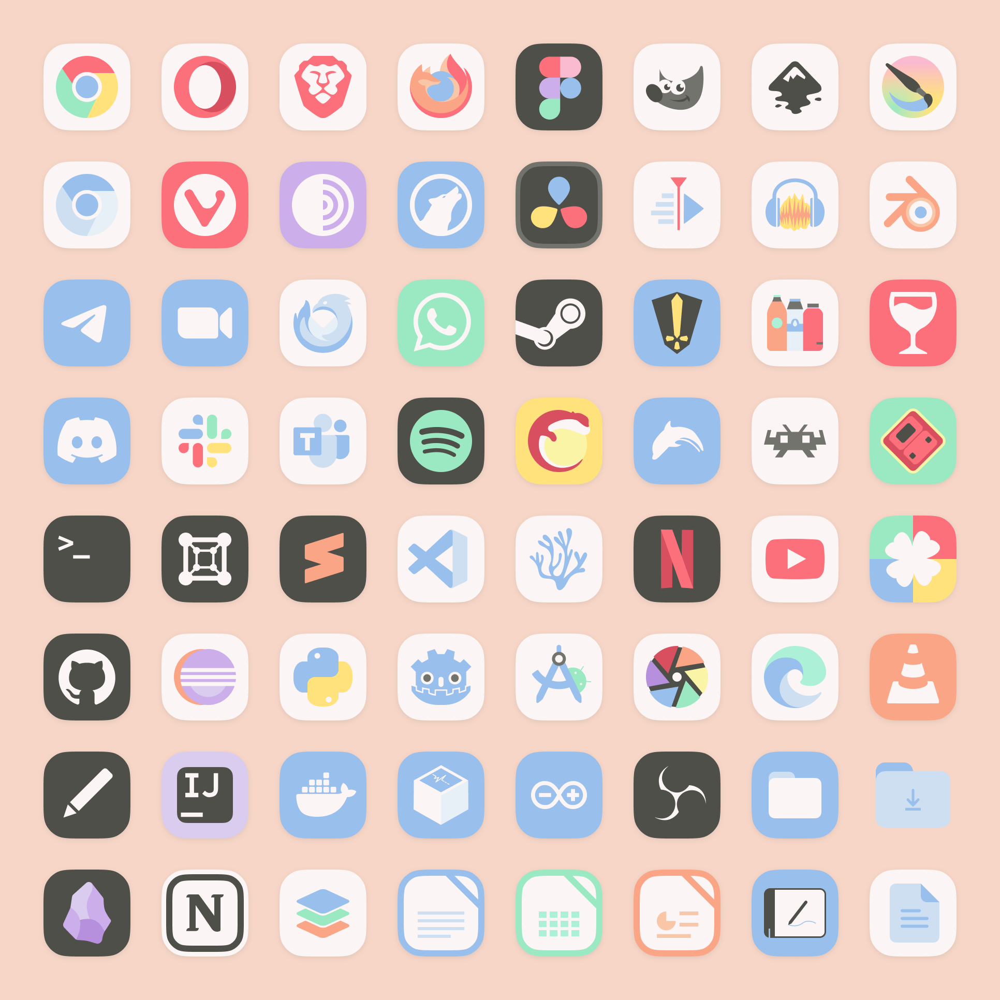
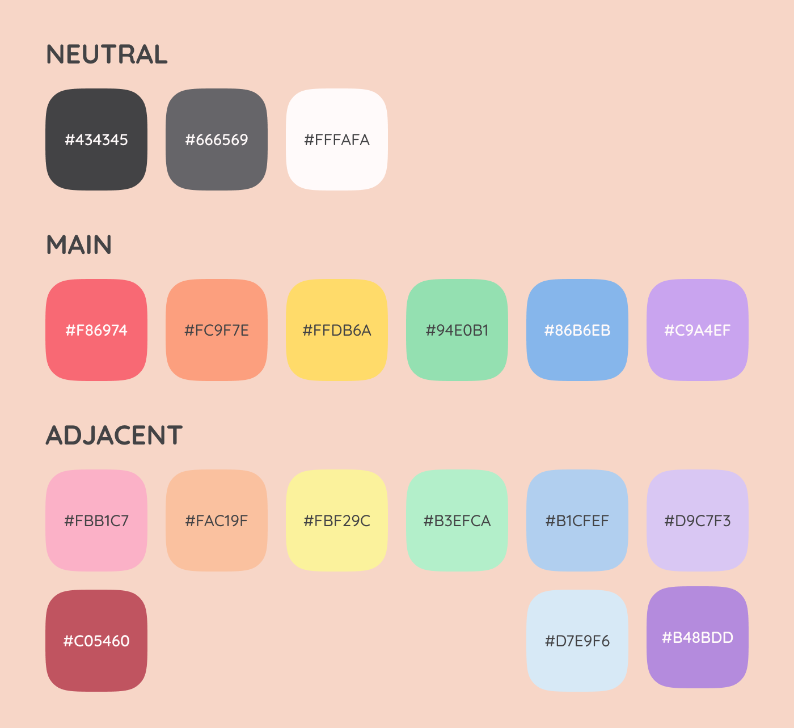

# Mignon-Pastel Icon Theme: Sweetness for Your Desktop!

Looking for a breath of fresh air for your Linux desktop?

✨ Well, look no further than Mignon-Pastel! It provides a platter of flat, pastel-colored icons that will add a lively touch to your workspace. I created it because finding the perfect pastel icon theme for my computer was a struggle. This theme is here to fill the void and bring a smile to your face every time you look your apps.

## Installation

Getting started with Mignon-Pastel is a breeze! Just follow these simple steps:

1. **Download or Clone this repository:** You can either download the theme as a compressed file or clone this repository using Git.

2. **Open a terminal in the `Mignon-icon-theme` folder:**

3. **Run the command:** `./install.sh` - That's it! Your icons will be available. 🪄

## Preview

## A Little More About Mignon Icons

I created it based on the [Tela-circle](https://github.com/vinceliuice/Tela-circle-icon-theme) icon theme by [vinceliuice](https://github.com/vinceliuice). Vince is, in my opinion, the best *Linuxer Designer* there is, his themes are gorgeous, and I wouldn't even be able to do the installation script and icon linkage if not by looking at his work.

🎨 The theme has a very restricted palette, consisting of 6 main colors, 3 neutral colors, and 9 secondary colors that I used only for shading or when it was *extremelly necessary*.

## Contributing

I'd love to see fellow customization/FOSS design enthusiasts! Feel free to contribute to the Mignon-Pastel by creating icons for new applications or suggesting improvements, I only ask you to stick to the defined color palette.
